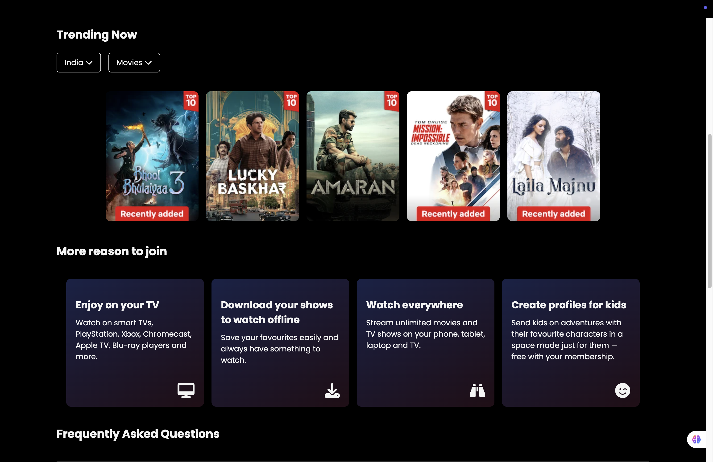
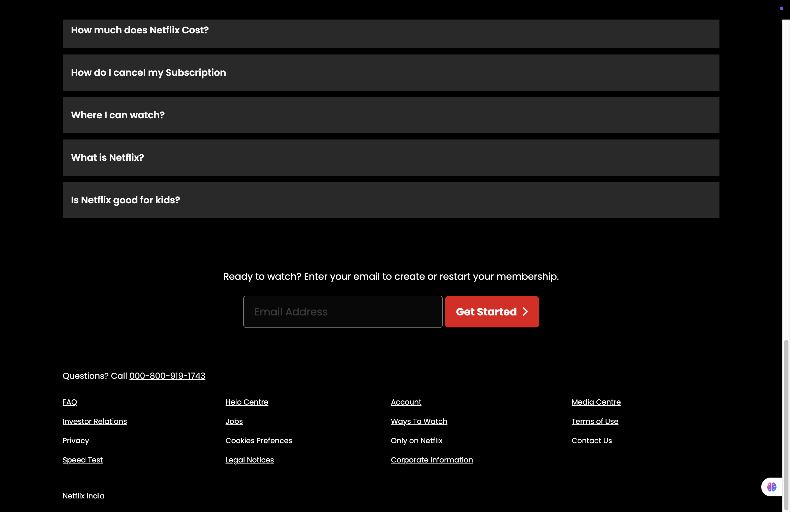

# 🎬 Netflix Clone (UI Only)

This is a **Netflix Clone** website built using **HTML** and **CSS**. It's a front-end-only project created to practice web development skills by replicating the look and feel of Netflix's homepage.

## 🔗 Live Demo

👉 [View Website](https://dishant-hooda.github.io/Netflix-Clone/)

## 🚀 Features

- Netflix-style UI
- Navigation bar, hero banner, and rows of thumbnails
- Hover effects on movie thumbnails
- Clean and structured HTML/CSS code

> ⚠️ This is **not a functional clone** — no backend or streaming functionality. It is strictly for **educational and UI practice**.

## 🛠️ Tech Stack

- HTML5
- CSS3

## 📸 Screenshots





## 📁 Folder Structure

Netflix-Clone/
├── index.html
├── style.css
├── images/
│ ├── logo.png
│ ├── banner.jpg
│ └── thumbnails/

## 📚 What I Learned

- Using Flexbox for layout
- Responsive design basics
- Hover transitions
- Web page structuring

## ✅ How to Run Locally

1. Clone this repo:
   ```bash
   git clone https://github.com/dishant-hooda/Netflix-Clone.git
   
2. Open index.html in your browser.

No installation or build process required.

## 🧭 Walkthrough

Here's a quick overview of how the Netflix Clone UI looks and flows:

1. **Navbar**  
   Includes the Netflix logo and navigation links like Home, Series, Movies, etc.

2. **Hero Section / Banner**  
   Displays a featured show or movie with a title, description, and action buttons.

3. **Movie Rows**  
   Horizontally scrollable lists of movie thumbnails categorized by genre or type.

4. **Hover Effects**  
   When you hover over a thumbnail, it slightly scales up for a dynamic effect.

📷 You can view the full experience here: [Live Site](https://dishant-hooda.github.io/Netflix-Clone/)


